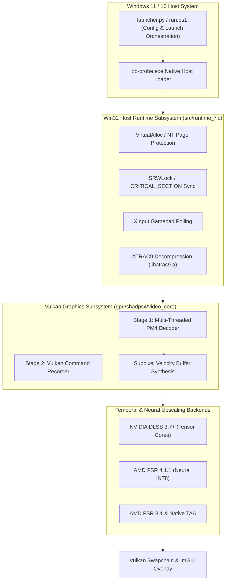

<div align="center">

# Bloodborne™ PC (Windows 11 / 10 Native Port)

### High-Performance x86-64 Native Runtime & Vulkan 1.3 Translation Layer

[](https://microsoft.com)
[](https://vulkan.org)
[](https://isocpp.org)
[](LICENSE)
[](https://github.com)

**English** · [Teknik Mimari Dokümanı](docs/ARCHITECTURE.md)

</div>

---

> [!IMPORTANT]
> **LEGAL DISCLAIMER & CLEAN-ROOM RESEARCH NOTICE**  
> This project is an independent research implementation and runtime translation layer.  
> **NO GAME ASSETS OR PROPRIETARY BINARIES ARE INCLUDED.** You must provide your own legally obtained dump of *Bloodborne* (PlayStation 4, Title ID: `CUSA03173`, Update v1.09).  
> This project is not affiliated with, authorized, endorsed by, or in any way connected with Sony Interactive Entertainment, FromSoftware, AMD, or NVIDIA.

---

## ⚡ Overview

**winportbb** is a specialized native Windows port and graphics translation layer for *Bloodborne* (PS4). 

Unlike traditional emulators that simulate an entire PlayStation 4 operating system and virtualize hardware:
- **Direct CPU Execution:** Because the PlayStation 4 uses an x86-64 AMD Jaguar CPU, the game's compiled machine code executes **natively and directly** on your PC's CPU with zero instruction translation and zero CPU emulation overhead.
- **Custom Win32 Subsystem Runtime:** A lightweight C11 runtime (`src/runtime_*.c`) replaces the PS4 FreeBSD kernel and libraries (`libc`, `libSceFios2`, memory management, threading, synchronization, and audio).
- **Vulkan 1.3 Graphics Translation:** The game's GPU command stream and shaders are translated directly into modern Vulkan 1.3 draw pipelines with multi-threaded command recording and subpixel temporal upscaling.

---

## 🌟 Key Features & Engineering Highlights

| Feature | Description |
|---|---|
| 🚀 **Native x86-64 Execution** | Runs game code at native bare-metal speed with direct CPU thread scheduling. |
| 🤖 **NVIDIA DLSS Integration** | Dynamic bridge loader enabling NVIDIA Tensor Core AI upscaling (RTX 20/30/40 series). |
| ⚡ **AMD FSR 4.1.1 Neural** | Custom INT8 neural upscaling passes optimized with Vulkan workgroup shared memory. |
| 🛡️ **Subpixel Jitter Alignment** | Reconstructed camera motion vectors with corrected subpixel jitter phases (`fsr4_invert_jitter=0`) for rock-solid temporal stability. |
| 🔓 **Unlocked Frame Rates** | Full support for **144 FPS, 120 FPS, 90 FPS, 60 FPS**, and Uncapped modes synchronized with real game delta-time. |
| 🧠 **Intel Hybrid CPU Affinity** | Automatic P-Core locking (`0x0FFF`) for Intel 12th, 13th, and 14th Gen processors, eliminating E-Core thread stutter. |
| 💾 **6GB / 8GB VRAM Safe Mode** | Active LRU texture cache eviction capped at 6144 MiB, preventing out-of-memory crashes on mainstream laptop GPUs. |
| 🌍 **Multi-Language GUI Launcher** | Modern tkinter launcher with 8 languages (TR, EN, DE, ES, FR, RU, JA, ZH), folder picker, and save backup manager. |
| 🎮 **In-Game ImGui Overlay** | Real-time overlay menu (`Insert` or `L3 + R3`) with live language switcher (Turkish/English/Russian) and Latin Extended UTF-8 glyph support. |

---

## 🏗️ Systems Architecture



> For an in-depth analysis of memory hierarchy, Data-Oriented Design (DOD), and zero-cost abstractions, see [docs/ARCHITECTURE.md](docs/ARCHITECTURE.md).

---

## 🚀 Quickstart Guide (Windows)

### 1. Prerequisites
- **Operating System:** Windows 10 (64-bit) or Windows 11.
- **Compiler Toolchain:** [MSYS2](https://www.msys2.org/) with UCRT64 environment (`gcc`, `g++`, `cmake`, `ninja`).
- **GPU:** Vulkan 1.3 compatible graphics card (NVIDIA GeForce GTX 1060+ / RTX series, AMD Radeon RX 5000+, or Intel Arc).
- **Game Files:** Legally dumped *Bloodborne* PS4 directory containing `eboot.bin` (v1.09).

### 2. Fast Build via PowerShell
Open PowerShell in the project directory:

```powershell
# Build all components (LibAtrac9, GPU library, and Host Loader)
.\build.ps1
```

*(Optional: Fetch official NVIDIA DLSS runtime dependencies with one command):*
```powershell
python scripts/fetch_dlss.py
```

### 3. Launching the Game

#### Option A: Definitive GUI Launcher (Recommended)
Double-click `Launch_Launcher.bat` or run:
```powershell
python launcher.py
```
- Select your Bloodborne folder using the **Browse (Gözat...)** button.
- Choose your preferred target FPS (60, 90, 120, 144, or Uncapped).
- Select your Upscaler (**NVIDIA DLSS**, **FSR 4.1.1**, **FSR 3.1**, or **TAA**).
- Click **⚔️ PLAY**.

#### Option B: Fast CLI Batch Launch
Double-click `Launch_Bloodborne.bat` or run:
```powershell
.\run.ps1 -GameDir "D:\Games\Bloodborne\CUSA03173" -Fps uncap
```

---

## 🎮 In-Game Controls & Hotkeys

| Hotkey | Action |
|---|---|
| `Insert` or `L3 + R3` | Toggle in-game configuration overlay menu |
| `F11` or `Alt + Enter` | Toggle Fullscreen / Windowed mode |
| `F1` | Quick save backup |
| `Escape` | Close in-game menu |

---

## 📂 Repository Structure

```
winportbb/
├── .github/workflows/       # Automated GitHub Actions Windows CI build pipeline
├── docs/                    # Technical documentation & ARCHITECTURE.md
├── gpu/                     # Vulkan GPU translation layer & shader recompilers
│   ├── dlss_bridge/         # NVIDIA DLSS dynamic bridge interface
│   ├── shadps4/             # Core graphics pipeline & PM4 command processors
│   └── shim/                # SDL3 windowing, settings, and ImGui UTF-8 overlay
├── scripts/                 # ELF reconstruction, patch compilers & DLSS fetcher
├── src/                     # Win32 OS runtime (Memory, Threads, XInput, Audio)
├── tools/                   # GPU capabilities diagnostic utilities
├── build.ps1                # Automated PowerShell build script
├── run.ps1                  # Production launch orchestrator
├── launcher.py              # Definitive 8-language GUI Launcher
├── launcher_i18n.py         # Multi-language dictionary
├── Launch_Bloodborne.bat    # One-click desktop launcher
└── Launch_Launcher.bat      # One-click GUI launcher
```

---

## 🤝 Acknowledgments & Credits

- **[shadPS4 Team](https://github.com/shadps4-emu/shadPS4):** For the foundational Vulkan video core and GCN shader recompiler.
- **[deadinside28](https://github.com/deadinside28):** For early Linux proof-of-concept research.
- **[FireBurn](https://github.com/FireBurn/FSR-Vulkan):** For the standalone Vulkan FSR implementation.
- **[Thealexbarney](https://github.com/Thealexbarney/LibAtrac9):** For LibAtrac9 audio decompression.
- **[ocornut](https://github.com/ocornut/imgui):** For Dear ImGui.
- **Community Modders:** For frame rate and camera simulation patches.

---

## ⚖️ License

This project is licensed under the **GNU General Public License v2.0 (GPL-2.0)** - see the [LICENSE](LICENSE) file for details.
