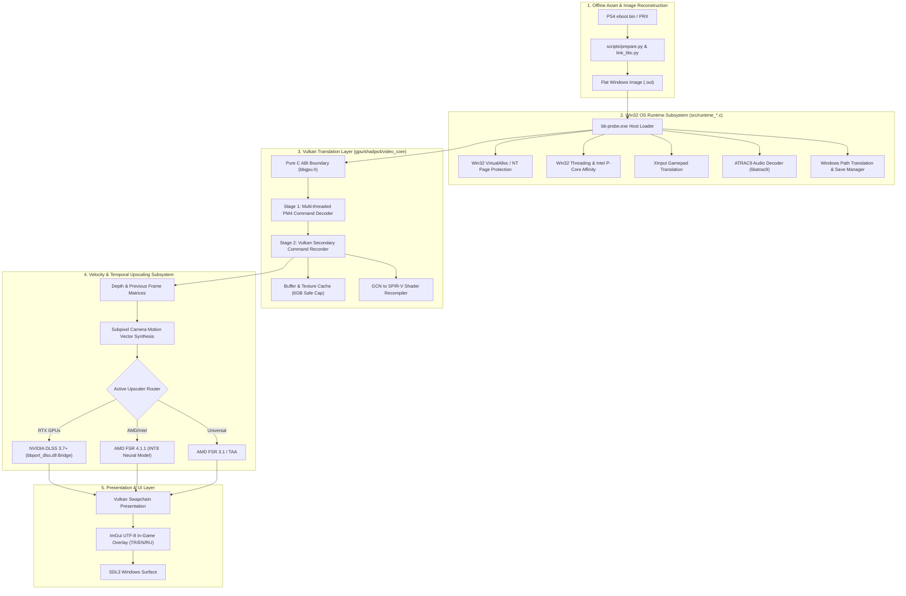

# Technical Architecture & Systems Engineering

> **A Low-Level Systems and Graphics Architectural Overview of the Bloodborne Windows Port (`winportbb`)**

---

## 1. Architectural Philosophy: Data-Oriented Design vs. "Clean Architecture"

In enterprise web or backend engineering, "Clean Architecture" (Entities, Use Cases, Repositories, Controllers, and heavy dynamic polymorphism) is popular for isolating business rules. However, in **low-level systems programming, game engines, and graphics emulation**, applying classic OOP Clean Architecture is an anti-pattern that leads to severe performance degradation.

### 1.1 The Hardware Reality (Memory Hierarchy & Frame Budgets)
At a target of **120 FPS**, the rendering engine has a strict frame budget of **8.33 milliseconds**.
- **L1 Cache:** ~1 ns (~4 cycles)
- **L2 Cache:** ~3-4 ns (~14 cycles)
- **L3 Cache:** ~10-12 ns (~40 cycles)
- **Main DRAM:** ~60-100 ns (**200+ cycles**)

Classic OOP Clean Code scatters small objects across the heap (`std::shared_ptr`, factories, DTOs). In a high-frequency game rendering loop, traversing scattered pointer chains causes severe CPU cache misses and Memory Stalls.

### 1.2 Virtual Dispatch (vtable) and Vectorization
Classic Clean Code abstracts every operation behind virtual interfaces (`IVulkanBuffer`, `IMemoryBlock`). 
- Bloodborne dispatches thousands of draw calls and PM4 packets per frame.
- Virtual function calls require an indirect pointer dereference through a `vtable`, preventing the CPU's branch target buffer (BTB) from predicting jumps accurately.
- Most importantly, virtual calls **defeat compiler inlining and SIMD auto-vectorization (AVX2/FMA)**.

### 1.3 The Chosen Architectural Model: Data-Oriented Systems Architecture
Instead of classic OOP, `winportbb` is built on **Data-Oriented Design (DOD)** and **Modern C++20 / C11 Systems Architecture**:
1. **Contiguous Memory Layouts:** Data is organized in flat, contiguous memory buffers (linear arenas, ring buffers, pool allocators).
2. **Zero-Cost Abstractions:** Polymorphism is achieved via C++ templates, `std::span`, and compile-time `constexpr` evaluation rather than runtime vtables.
3. **Pure C ABI Boundaries:** Subsystems communicate across clean, stable C ABI boundaries (`bbgpu.h`, `bbport_dlss_bridge.h`), preventing C++ name mangling issues and standard library version mismatches between compiled modules.
4. **Strict RAII (Resource Acquisition Is Initialization):** Windows handles (`HANDLE`, virtual memory ranges) and Vulkan handles (`VkDeviceMemory`, `VkBuffer`, `VkImageView`) are strictly managed with zero memory leaks.

---

## 2. Global Subsystem Architecture

---

## 3. Subsystem Breakdown

### 3.1 Subsystem 1: Offline Image Preparation (`scripts/`)
- **ELF Reconstitution:** Converts the PlayStation 4 FreeBSD-style ELF `eboot.bin` into a flat, relocatable native memory image.
- **Symbol Linking:** Resolves PS4 system calls (`libc.prx`, `libSceFios2.prx`) and patches imports to route directly into our host runtime functions, bypassing OS-level emulation overhead.
- **Thread Pointer Patching:** Identifies and rewrites PS4 thread pointer loads (`fs:`) to Windows x86-64 thread environment registers (`gs:`).

### 3.2 Subsystem 2: Win32 OS Runtime (`src/runtime_*.c`)
- **Virtual Memory (`runtime_memory.c`):**
  - Maps PS4 unified memory (Direct Memory / Flexible Memory) into Windows 64-bit address space using `VirtualAlloc` with `MEM_RESERVE` and `MEM_COMMIT`.
  - Implements POSIX `mprotect` equivalents via Win32 `VirtualProtect`.
- **Thread Scheduling & Intel Hybrid Affinity (`runtime_thread.c`):**
  - PS4 games assume 6 to 7 identical Jaguar x86 cores.
  - On modern hybrid Intel architectures (12th, 13th, 14th Gen Core i5/i7/i9), guest threads are pinned to high-performance P-Cores using `SetThreadAffinityMask(0x0FFF)`, preventing game threads from being scheduled onto slower E-Cores.
- **Synchronization Primitives (`runtime_mutex.c`, `runtime_sema.c`, `runtime_rwlock.c`):**
  - Maps PS4 kernel semaphores and mutexes to Win32 `SRWLOCK`, `CRITICAL_SECTION`, and Windows Event objects for low-latency synchronization without context switching.
- **Controller Polling (`runtime_pad.c`):**
  - Translates DualShock 4 reports into `XInputGetState` calls, providing native support for Xbox, PlayStation (via DS4Windows/DualSense), and generic XInput gamepads.

### 3.3 Subsystem 3: Multi-Threaded Vulkan Graphics Pipeline (`gpu/`)
- **Two-Stage Command Processor:**
  - **Stage 1 (Decode Thread):** Reads the raw PS4 PM4 packet stream from guest memory and unmarshals draw arguments, viewport state, and shader binding slots.
  - **Stage 2 (Recording Thread):** Binds Vulkan descriptor sets, pushes constants, and records into Vulkan command buffers concurrently.
- **Texture Cache with VRAM Safe Mode:**
  - Emulates unified APU memory on discrete GPUs by staging texture buffers.
  - A texture collector runs an LRU eviction policy (freeing unused textures after 20 seconds).
  - Capped at **6144 MiB (6 GB)** to guarantee zero crash rates on mainstream laptop GPUs (RTX 4060 Laptop, RTX 3060 Laptop, GTX 1660 Ti).

### 3.4 Subsystem 4: Motion Vector Synthesis & Upscaling Pipeline
- **Motion Vector Reconstruction:**
  - Bloodborne does not natively output a screen-space velocity buffer (motion vectors).
  - The renderer intercepts vertex transforms and projection matrices, combining scene depth with previous-frame camera matrices to reconstruct subpixel screen-space motion vectors.
- **Subpixel Jitter Alignment:**
  - A Halton(2,3) subpixel sequence is applied to the rasterizer viewport.
  - Fixed inverted jitter phase calculation (`fsr4_invert_jitter=0`) to ensure temporal accumulators correctly align subpixel samples rather than creating visual shimmer.
- **Upscaler Backends:**
  - **NVIDIA DLSS:** Dynamic ABI bridge (`bbport_dlss.dll` -> `nvngx_dlss.dll`) utilizing NVIDIA Tensor Cores.
  - **AMD FSR 4.1.1 Neural:** Custom INT8 compute passes optimized for Vulkan workgroup memory.
  - **AMD FSR 3.1 & Native TAA:** Universal fallback for any Vulkan 1.3 capable GPU.

### 3.5 Subsystem 5: Presentation & Multi-Language Overlay
- **In-Game Overlay (`bbport_overlay.cpp`):**
  - Rendered using Dear ImGui with custom Vulkan pipeline hooks.
  - Full Unicode font rasterization with extended Latin-A ranges (`0x0100 - 0x017F`), supporting Turkish (`ç, ğ, ı, ö, ş, ü`), English, and Russian seamlessly.
  - Live runtime switching of upscalers, sharpness, graphical effects, and languages without restarting the game.

---

## 4. Concurrency & Thread Synchronization Model

| Thread Name | Responsibility | Synchronization Primitive |
|---|---|---|
| `Main Guest Thread` | Bloodborne game loop & logic | OS Thread Handle |
| `Audio Worker` | ATRAC9 decompression & mixing | Win32 Semaphore / Ring Buffer |
| `GPU Decode Thread` | PM4 packet decoding | Double-buffered ring buffer |
| `GPU Record Thread` | Vulkan command recording | `VkFence`, `VkSemaphore` |
| `Texture Eviction Worker`| LRU memory recycling (every 5s) | Win32 Condition Variable |

---

## 5. Security, Copyright, and Redistribution Model

This codebase adheres to clean-room reverse engineering and systems research standards:
- **No Proprietary Binaries:** Sony `eboot.bin`, game PRX modules, textures, audio, and FromSoftware assets are excluded from the repository.
- **Dynamic DLSS Loading:** NVIDIA proprietary DLLs (`nvngx_dlss.dll`) are loaded dynamically via runtime `LoadLibraryA` without linking proprietary static SDK libraries.
- **Legal Redistribution:** All project-authored code is distributed under the GNU General Public License v2.0 (GPL-2.0).
